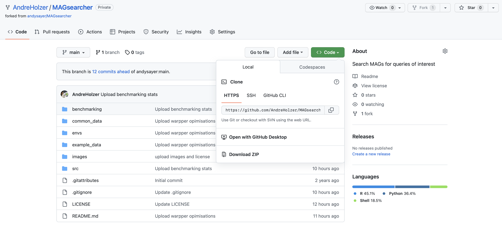

# How to install MAGsearcher

[](GS.md) [](index.md) [](US.md)

----


## Clone/Download the repository from Github

### For Linux and Mac:

Open a new terminal/shell and go to the directory you'd like to contain the MAGsearcher directory
```
cd ./scripts/  
```
Get the latest version/release of the tool using the Pull or Git clone command
```
 git clone https://github.com/AndreHolzer/MAGsearcher --recursive
```
Alternatively you can manually download the MAGsearcher folder

Go to the [MAGsearcher GitHub page](https://github.com/AndreHolzer/MAGsearcher) and download the latest release as .zip file or use this [quick download link](https://github.com/AndreHolzer/MAGsearcher/archive/master.zip) to get the latest version.


Unzip the folder using a common archive managing software

Once downloaded make the MAgsearcher diretory your new working directory
```
cd MAGsearcher
```
Check Conda for updates and install mamba
```
conda update conda
conda install mamba -c conda-forge
```
Ceate Magsearcher envionemnt 
```
mamba env create --file ./envs/conda_environment.yaml
```
The conda envionemnta can now be actiavted using
```
conda activate magsearcher
```


----
Now you are fully set up to start [using MAGsearcher](US.md)
