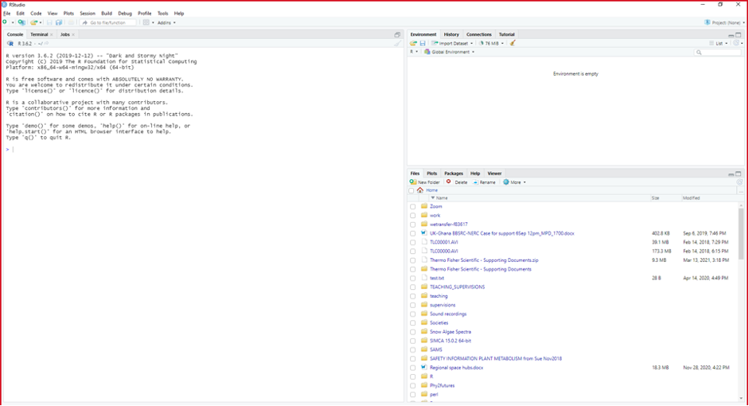
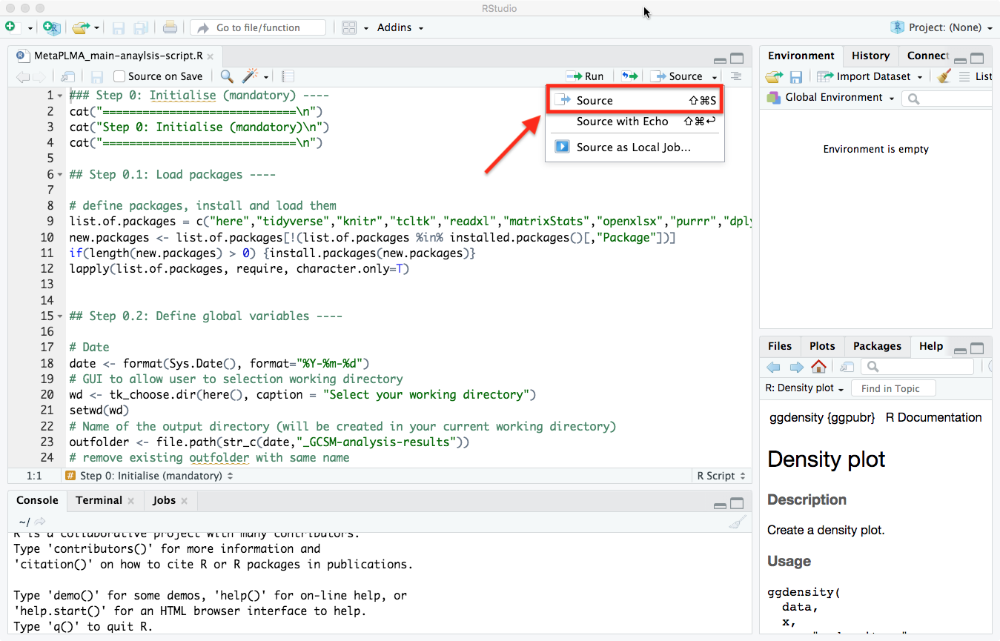

<a href='https://github.com/AndreHolzer/MAGsearcher'></a>

# Execute MAGsearcher 

[](US.md) [](index.md) [](US_A.md)

----


## The MAGsearcher wrapper

***(minimal code interaction + complete progress log + detailed error reporting)***

MAGsearcher comes with a warpper script that allows for a smooth and easy operation through the individula steps of the algorithm. Using the wrapper script does not require any deeper knowledge of R or Python coding nor requires advanced computational skills but rather can be operated by anyone that has a basic understanding of bash scripting. 


#### **Start analysing using the MAGsearcher wrapper:**

##### 1. Open the wrapper script and adjust the top section to match your data and mode of operation 

Via the terminal 

```
nano .scr/MAGsearcher_wrapper.sh
```

Or via a text/code editor like VSCode 




##### Mode of execution

Depending on the reseach question and input data, MAGsearcher can be run in 3 different modes. 

1. **Analysis of multiple whole genome assemblies on proteom level (Proteoms)**
2. **Analysis of binned metagenome assembled genomes (MAGs)**
3. **Combined analysis of MAGs and proteoms** **(MAGs+Proteoms)**


##### 2. Execute the wrapper script to start the analysis

Set working directory

```
cd MAGsearcher/scr/
```

Start the run

```
# on Linux
/usr/bin/time --verbose ./MAGsearcher_wrapper.sh > ./MAGsearcher_analysis.log 2>&1
# on MacOS
gtime -v ./MAGsearcher_wrapper.sh > ./MAGsearcher_analysis.log 2>&1
```

  

Once the sript has been started, you will see that a file called 'MAGsearcher_analysis.log' is created in the  working directory. Use this file to track progress and check for errors. Once the analysis has completed successfully, the .log file will be moved into your designated output directory.


> **Note:** If performing several analysis, please run them independently, one after the other. Pererforming parallel analyses is not supported by version 1.0 and will create issues.  


----

Next let's analyse some [example data](US_A.md)
